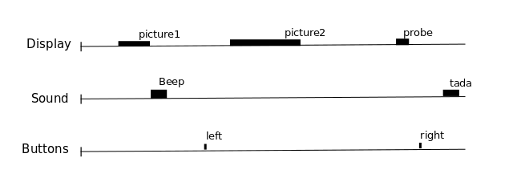
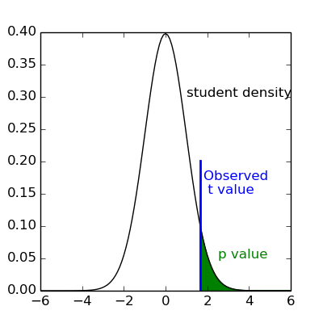
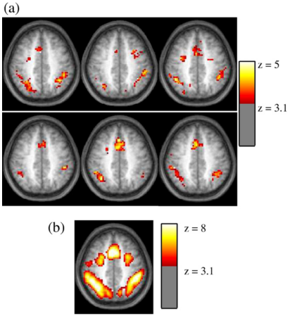

# fMRI Data

fMRI data consist of **time-series** (series of samples) in thousands voxels.

* The spatial resolution is the size of voxels in x, y, z. For example 2x2x2mm cubes.

* The sampling time (TR = Time of Repetition) is the duration between the onsets of successive scans.

Note: This can be represented as a 4D matrix, with coordinates x, y, z and t

Stored either as a series of 3D images (1 file per time point), or a single 4D file.

---

# Searching for voxels that respond to some stimulation, action, ...

Given the history of stimulation, actions, ...

One can construct **predictors** of the BOLD response by convoluting the stimulation variables with the *impulse Haemodynamics Response Function*.

---

# Example of Periodic auditory stimulation. 

* Red curve (model)=Predictor. 
* Blue curve  = time course in a given voxel of the auditory cortex

One can compute the *correlation* between the model and the data. 

One can do this at every brain voxel and produce a correlation map.

---

# correlation maps

Correlations are numbers within [-1; +1]

If an observed correlation is "large enough", it is unlikely to be due to chance, and more likely to reflect a real effect.

---

# Statistical testing

Let's suppose that all the subjects have a positive correlation in a given voxel, if there are enough subjects, this is convincing evidence that the effect is no due to chance (think about coin dropping).

*p-value* = Probability the effect is equal of larger than the average observed effect (here the average correlation) under the Null hypothesis of pure noise.

when the p-value < alpha-threshold, we deem the effect "statistically significant".

---

# t-values or z-values maps

* A student t-test produces a t-value
* A normal test produces a z-value

There are one-to-one relations t-value<=> p-value <=> z value

---

# individual vs. group maps

---

# Beyond correlation: multiple regression

Correlation is limited to one variable, but we often have several predictors:

* predictors of interest, linked to the experimental design
* counfond variables (of no interest) 

**Regression**: Fitting a linear model, i.e.

Given data y, and predictors arranged in a X matrix, find β values such that minimizes ‖y - X.β‖.

=> This yildes ine parameter for each predictor (amplitude of the response to the predictor when the other are kept constant), and its significance.

See <https://online.stat.psu.edu/stat462/node/132/>

**Contrasts**: are used to compare parameters (is the response to one condition stronger than another?)

See Chapter 8 of <https://www.fil.ion.ucl.ac.uk/spm/doc/books/hbf2/>

---

Difference between strength of response and fit (or significance)

---

# Univariate analysis of fMRI images

1.    Describe the paradigm in terms of events grouped by type, occurring at certain times and having specific durations.
2.    Create predictors for each type of event, typically using a convolution by the haemodynamic response.
3.    Assemble these predictors in a design matrix, providing a linear model.
4.    Estimate the parameters of the model, i.e., the weights associated with each predictor at each voxel, using linear regression.
5.    Display the coefficients or their linear combinations (contrasts), and/or their statistical significance. Optionnaly correcting for the issue of multiple comparisons.

see <http://nilearn.github.io/glm/glm_intro.html#fmri-statistical-analysis> from <http://nilearn.github.io/glm/index.html>

Hands-on exercices at <http://nilearn.github.io/auto_examples/index.html>

---

